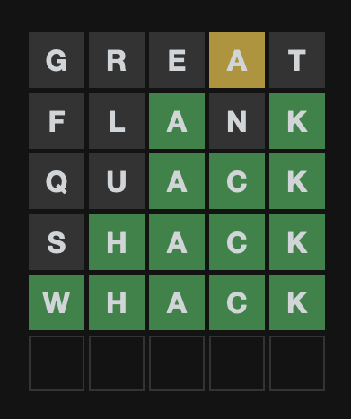
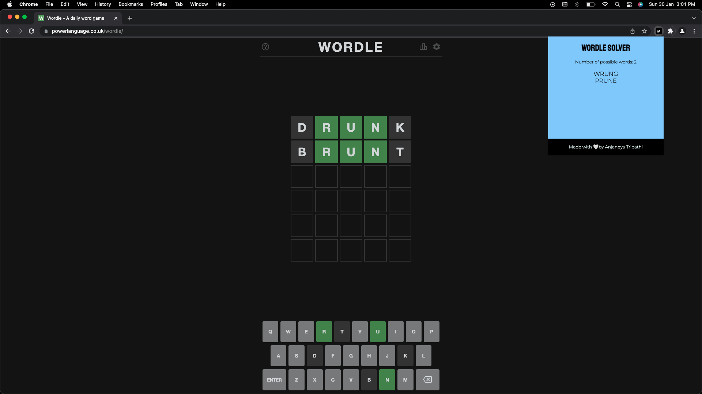

# Wordle Solver



Look familiar? If not, head over to [this](https://www.powerlanguage.co.uk/wordle/) site to try it out! 
If you've played this game before, you probably would have been at loss of words. So try this out and make sure you don't lose!

## Chrome Extension

```
CHROME EXTENSION IS UNAVIALBLE VIA THE CHROME STORE AT THE MOMENT, IT IS UNDER REVIEW. TILL THEN YOU CAN CLONE AND USE THE REPO. INSTRUCTIONS GIVEN BELOW.
```



Just add this extension to your browser and you're ready! Get live updates after each attempt. Never run out of chances, so what are you waiting for? Download it now!


## Using the Repo

Clone the repo into your system and `cd` into it. 

```
git clone https://github.com/AnjaneyaTripathi/wordle-solver
```

In order to use the extension in developer mode, follow the steps given below.

1. Open Google Chrome.
2. Go to the extensions dropdown and click *Manage Extensions*.
3. In the top right corner, toggle the developer mode so that it is switched on.
4. Then click the *Load Unpacked* button and select the `wordle-solver` folder.
5. Pin the extension and get started! 🚀

## Found a Bug?

Feel free to raise an issue!
